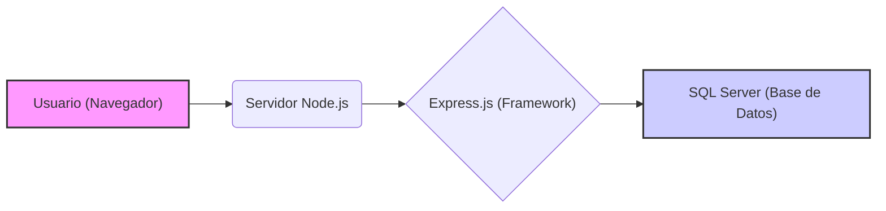

# Desarrollo Web

Esta sección te guiará a través de la configuración inicial para comenzar con el desarrollo web utilizando Node.js y Express, con una base de datos SQL Server.

## Prerrequisitos

Antes de comenzar, asegúrate de tener instalado lo siguiente:

* **nvm (Node Version Manager):** Se recomienda utilizar nvm para gestionar diferentes versiones de Node.js en tu sistema. Esto evita problemas de compatibilidad entre proyectos (algunos crean proyectos con versiones de node que nunca actualizan). Puedes instalarlo desde [este enlace](https://github.com/coreybutler/nvm/releases).
    > **Importante:** Si ya tienes Node.js instalado de forma tradicional (sin nvm), te recomendamos desinstalarlo primero para evitar conflictos. nvm gestiona sus propias versiones de Node.js de manera aislada.

* **Node.js (última versión LTS):** Una vez que tengas nvm instalado, puedes instalar la última versión LTS (Long Term Support) de Node.js ejecutando el siguiente comando en tu terminal:
    ```bash
    nvm install --lts
    nvm use --lts
    ```

## Stack Tecnológico

Nuestro stack tecnológico para este ejemplo incluirá:

* **Backend:** Node.js - Un entorno de ejecución de JavaScript del lado del servidor.
* **Framework:** Express.js - Un framework web minimalista y flexible para Node.js.
* **Base de Datos:** SQL Server - Un sistema de gestión de bases de datos relacional.



Proximamente añadiremos React a este Stack.

## ¡Hola Mundo con Express!

Ahora, vamos a crear una aplicación "Hola Mundo" básica utilizando Express para verificar que nuestro entorno de Node.js está configurado correctamente.

1.  **Crea un Nuevo Directorio:** Abre tu terminal y crea un nuevo directorio para tu proyecto:
    ```bash
    mkdir hola-mundo-express
    cd hola-mundo-express
    ```

2.  **Inicializa el Proyecto:** Inicializa un nuevo proyecto de Node.js utilizando npm (Node Package Manager, que viene con Node.js):
    ```bash
    npm init -y
    ```
    Esto creará un archivo `package.json` en tu directorio.

3.  **Añadir `.gitignore`:** Crea un archivo llamado `.gitignore` en la raíz de tu proyecto y agrega las siguientes líneas para excluir archivos innecesarios del control de versiones:

    ```gitignore
    node_modules/
    .env
    .DS_Store
    ```

4.  **Instala Express:** Instala el framework Express como una dependencia de tu proyecto:
    ```bash
    npm install express
    ```

5. **Modifica `package.json`**

    Abre el archivo `package.json` en tu directorio del proyecto y añade la siguiente línea dentro del objeto principal:


    ```json
    {
        "type": "module",
        // ... otras configuraciones ...
    }
    ```

    Esto le dice a Node.js que trate los archivos `.js` en este proyecto como módulos ES. ([Ejemplo de como se veria el archivo `package.json`](https://github.com/Carlitoshsh/bill-xp-api/blob/main/package.json#L6))

6.  **Crea el Archivo `server.js`:** Crea un nuevo archivo llamado `server.js` en tu directorio del proyecto y pega el siguiente código:

    ```javascript
    // Importa la libreria express
    import express from 'express';
    // Inicializa la app como parte de express
    const app = express();
    // Puerto en el que correra la app
    const port = 3000;

    app.get('/', (req, res) => {
      res.send('¡Hola Mundo desde Express!');
    });

    app.listen(port, () => {
      console.log(`🚀 Servidor escuchando en http://localhost:${port}`);
    });
    ```

7.  **Añadir a scripts de package.json:** En el archivo `package.json`, dentro del objeto `"scripts"`, agrega la siguiente línea para definir un comando de desarrollo:

    ```json
    "scripts": {
      "dev": "node server.js"
    }
    ```

8.  **Ejecuta la Aplicación:** En tu terminal, dentro del directorio del proyecto (`hola-mundo-express`), ejecuta el siguiente comando para iniciar el servidor:

    ```bash
    npm run dev
    ```

    

    ###### ¿Por qué añadimos `"dev": "node server.js"` a los scripts de `package.json`?
    
    - **Facilidad de ejecución:** En lugar de escribir `node server.js` cada vez que quieras iniciar el servidor, solo necesitas ejecutar `npm run dev`, simplificando el proceso y evitando errores tipográficos.
    
    - **Estandarización:** En proyectos más grandes, es común definir varios scripts (`start`, `test`, `build`, etc.). Al agregar un script de desarrollo (`dev`), seguimos una convención que facilita la colaboración con otros desarrolladores.
    
    - **Compatibilidad con herramientas externas:** Algunos entornos de desarrollo y despliegue utilizan los scripts de `package.json` para automatizar tareas. Definir `dev` permite que herramientas como `nodemon` (para reinicios automáticos) se integren fácilmente.
    
    En resumen, este pequeño ajuste mejora la experiencia de desarrollo y hace que el flujo de trabajo sea más eficiente. 🚀


9.  **Visualiza el Resultado:** Abre tu navegador web y navega a `http://localhost:3000`. Deberías ver el mensaje "¡Hola Mundo desde Express!".


¡Felicidades! Has configurado tu entorno de desarrollo con Node.js y Express, y has creado tu primera aplicación web. En las siguientes secciones, exploraremos cómo conectar tu aplicación a la base de datos SQL Server.
