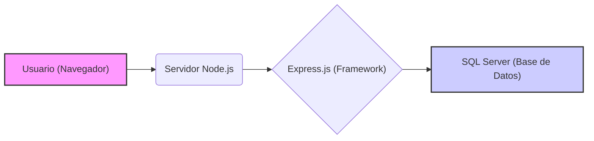

# Desarrollo Web

Esta sección te guiará a través de la configuración inicial para comenzar con el desarrollo web utilizando Node.js y Express, con una base de datos SQL Server.

## Prerrequisitos

Antes de comenzar, asegúrate de tener instalado lo siguiente:

* **nvm (Node Version Manager):** Se recomienda utilizar nvm para gestionar diferentes versiones de Node.js en tu sistema. Esto evita problemas de compatibilidad entre proyectos (algunos crean proyectos con versiones de node que nunca actualizan). Puedes instalarlo desde [este enlace](https://github.com/coreybutler/nvm/releases).
    * **Importante:** Si ya tienes Node.js instalado de forma tradicional (sin nvm), te recomendamos desinstalarlo primero para evitar conflictos. nvm gestiona sus propias versiones de Node.js de manera aislada.

* **Node.js (última versión LTS):** Una vez que tengas nvm instalado, puedes instalar la última versión LTS (Long Term Support) de Node.js ejecutando el siguiente comando en tu terminal:
    ```bash
    nvm install --lts
    nvm use --lts
    ```

## Stack Tecnológico

Nuestro stack tecnológico para este ejemplo incluirá:

* **Backend:** Node.js - Un entorno de ejecución de JavaScript del lado del servidor.
* **Framework:** Express.js - Un framework web minimalista y flexible para Node.js.
* **Base de Datos:** SQL Server - Un sistema de gestión de bases de datos relacional.



Proximamente añadiremos React a este Stack.

## Configuración de SQL Server

Para interactuar con SQL Server desde nuestra aplicación Node.js, necesitaremos lo siguiente:

1.  **Instalación de SQL Server:** Si aún no lo tienes instalado, deberás descargar e instalar SQL Server Developer Edition (que es gratuita para desarrollo) o cualquier otra edición que prefieras. Puedes encontrar las instrucciones de instalación en el sitio web de Microsoft.

2.  **SQL Server Management Studio (SSMS):** Esta herramienta proporciona una interfaz gráfica para administrar tus bases de datos SQL Server. También es recomendable instalarla.

3.  **Creación de una Base de Datos:** Utiliza SSMS para conectarte a tu instancia de SQL Server y crear una nueva base de datos que utilizará tu aplicación web.

4.  **Configuración de Autenticación:** Asegúrate de tener configurado un método de autenticación (por ejemplo, autenticación de Windows o autenticación de SQL Server con un usuario y contraseña) para acceder a tu base de datos. Anota las credenciales que necesitarás en tu aplicación.

## ¡Hola Mundo con Express!

Ahora, vamos a crear una aplicación "Hola Mundo" básica utilizando Express para verificar que nuestro entorno de Node.js está configurado correctamente.

1.  **Crea un Nuevo Directorio:** Abre tu terminal y crea un nuevo directorio para tu proyecto:
    ```bash
    mkdir hola-mundo-express
    cd hola-mundo-express
    ```

2.  **Inicializa el Proyecto:** Inicializa un nuevo proyecto de Node.js utilizando npm (Node Package Manager, que viene con Node.js):
    ```bash
    npm init -y
    ```
    Esto creará un archivo `package.json` en tu directorio.

3.  **Instala Express:** Instala el framework Express como una dependencia de tu proyecto:
    ```bash
    npm install express
    ```

4.  **Crea el Archivo `server.js`:** Crea un nuevo archivo llamado `server.js` en tu directorio del proyecto y pega el siguiente código:

    ```javascript
    const express = require('express');
    const app = express();
    const port = 3000;

    app.get('/', (req, res) => {
      res.send('¡Hola Mundo desde Express!');
    });

    app.listen(port, () => {
      console.log(`Servidor escuchando en http://localhost:${port}`);
    });
    ```

5.  **Ejecuta la Aplicación:** En tu terminal, dentro del directorio del proyecto (`hola-mundo-express`), ejecuta el siguiente comando para iniciar el servidor:
    ```bash
    node server.js
    ```

6.  **Visualiza el Resultado:** Abre tu navegador web y navega a `http://localhost:3000`. Deberías ver el mensaje "¡Hola Mundo desde Express!".

¡Felicidades! Has configurado tu entorno de desarrollo con Node.js y Express, y has creado tu primera aplicación web. En las siguientes secciones, exploraremos cómo conectar tu aplicación a la base de datos SQL Server.
